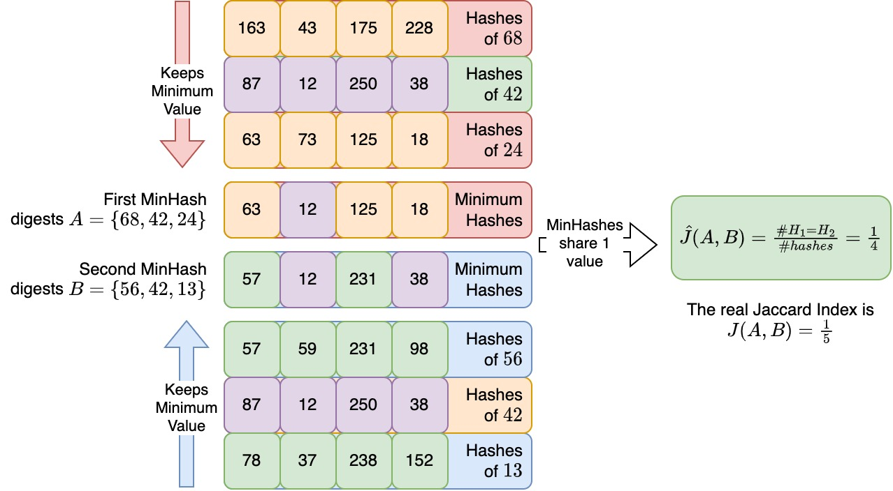
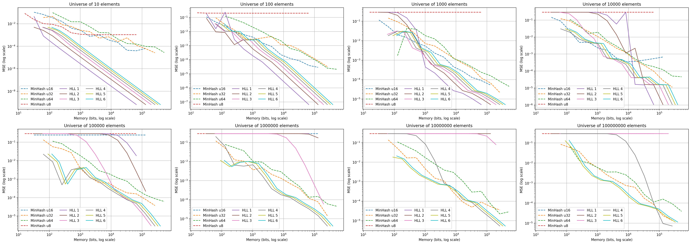
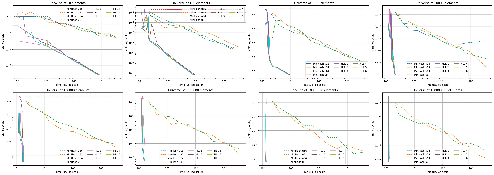
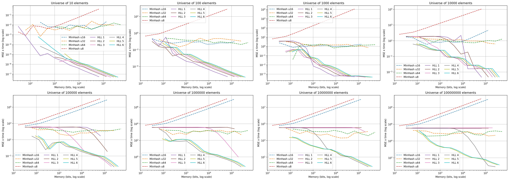
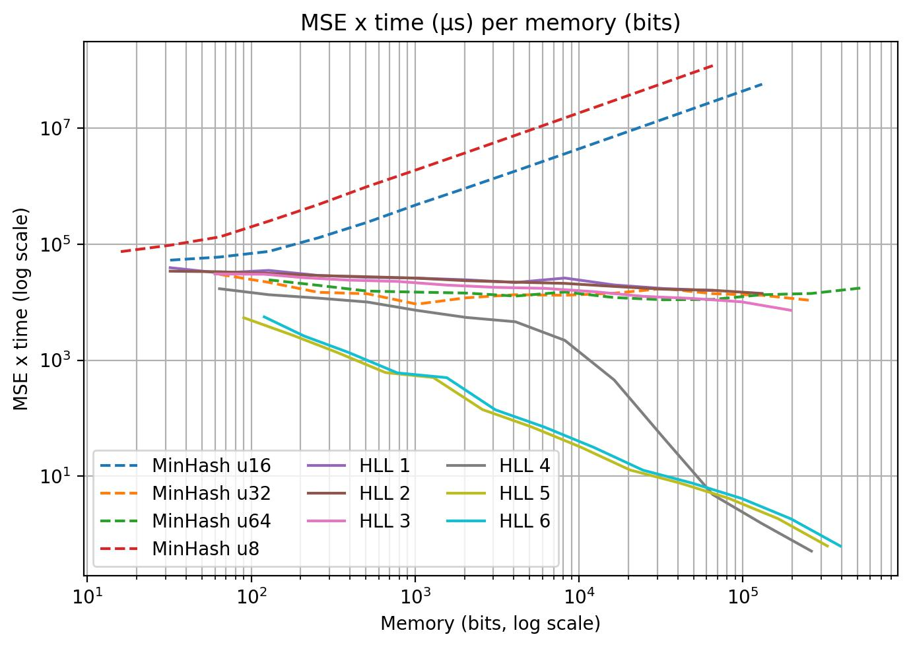

# MinHash Jaccard Index benchmarks

This report explores the performance of MinHash on the estimation of the Jaccard Index. It explores several MinHash parametrizations, including different words (u8, u16, u32 and u64) and numbers of permutations, and compares them against several parametrizations of [HyperLogLog](https://github.com/LucaCappelletti94/hyperloglog-rs) to determine the regions where, if any, MinHash is preferable to HyperLogLog. It covers universes of different cardinalities (10, 100, 1000, 10k, 100k, 1M, 10M and 100M) and compares the two methods at parity of memory and of time requirements.

This document replaces the original Jupyter notebook. The figures below are produced by `benchmarks/plot.py` from the committed result tables in `tests/`.

## Relevant vocabulary

This section defines several terms used across this report that a reader may not be familiar with. Feel free to skip it.

### What is a word in computer science?

With the term "word" we refer to a fixed-size unit of data that a computer processes as a single entity. It is typically determined by the system architecture and is used to represent and manipulate data in memory. Words have a specific size, such as 32 bits or 64 bits, and are used for storing variables, instructions and memory addresses.

### What is a random number generator?

A random number generator (RNG) is a computational algorithm or physical device that produces a sequence of numbers that appear to be statistically random. Pseudo-random number generators (PRNGs) use deterministic algorithms to produce a sequence of numbers that, while not truly random, approximate randomness. True random number generators rely on physical processes. PRNGs are suitable for most cases, and they are what this crate uses.

### What is SplitMix?

[SplitMix](https://dl.acm.org/doi/10.1145/2660193.2660195) is a simple and fast PRNG. It operates by repeatedly splitting and mixing a 64-bit seed value to produce a sequence of 64-bit pseudo-random numbers. It provides good statistical properties and a large period, and it is known for its speed and simplicity. It is not suitable for cryptographic applications.

```python
def splitmix(seed):
    seed += 0x9e3779b97f4a7c15
    seed = (seed ^ (seed >> 30)) * 0xbf58476d1ce4e5b9
    seed = (seed ^ (seed >> 27)) * 0x94d049bb133111eb
    return seed ^ (seed >> 31)
```

### What is XorShift?

[XorShift](https://www.jstatsoft.org/article/download/v008i14/916) is a family of PRNGs known for their simplicity and speed. These algorithms use bitwise XOR and bit-shifting operations to generate a sequence of pseudo-random numbers. Variations such as xorshift32 and xorshift64 differ in the size of their state variable and the specific bit operations used.

```python
def xorshift(seed):
    seed ^= (seed << 13)
    seed ^= (seed >> 17)
    seed ^= (seed << 5)
    return seed
```

### What is the Mean Squared Error?

[Mean squared error](https://en.wikipedia.org/wiki/Mean_squared_error) is a statistical measure of the average squared difference between predicted and actual values. To compute it you take the difference between each predicted value and its corresponding true value, square the differences, sum them and divide by the number of observations.

$$MSE(y, \hat{y}) = \frac{1}{n} \sum_{i}^{n} (y_i - \hat{y}_i)^2$$

## What is the Jaccard Index?

The Jaccard Index was proposed by Paul Jaccard in the 1912 paper ["The distribution of Flora in the Alpine zone"](https://nph.onlinelibrary.wiley.com/doi/abs/10.1111/j.1469-8137.1912.tb05611.x). It is a measure of similarity between two sets, defined as the size of the intersection divided by the size of the union. It is a number between 0 and 1, where 0 means the two sets are disjoint and 1 means they are identical.

$$J(A, B) = \frac{\lvert A \cap B\rvert}{\lvert A \cup B\rvert}$$

## What is MinHash?

The [MinHash data structure](https://ieeexplore.ieee.org/abstract/document/666900/) is a probabilistic technique for estimating the similarity between sets. It represents a set by a signature built from a fixed-size array of hash values. The "number of permutations" parameter is the number of hash functions used to generate the signature. By comparing the MinHash signatures of two sets the Jaccard similarity can be approximated. The number of permutations sets the trade-off between accuracy and computational cost: more permutations generally mean more accurate estimates but more work.

### A high level schema of MinHash

We have two sets, A and B, and we want to estimate the Jaccard index between them. We hash the elements of the two sets and keep track of the minimum hash value for each hash function. The probability that the minimum hash value of two sets is the same is equal to the Jaccard similarity between the two sets. By using multiple hash functions we estimate the Jaccard similarity by averaging over the agreements.



### Representing a set in a MinHash data structure

A MinHash data structure is a fixed-size array of hash values, one per permutation. In the Rust implementation in this repository we use a [SipHasher13](https://eprint.iacr.org/2014/722) followed by a [SplitMix](https://dl.acm.org/doi/10.1145/2660193.2660195) and then a number of [XorShift](https://www.jstatsoft.org/article/download/v008i14/916) steps for the permutations.

```python
set_to_digest = {"A", "B", ..., "All hail Cthulhu"}
number_of_permutations = 128
minhash = [float("inf") for _ in range(number_of_permutations)]

for element in set_to_digest:
    hashed_element = hash(element)
    for i in range(number_of_permutations):
        minhash[i] = min(minhash[i], hashed_element)
        hashed_element = hash(hashed_element)
```

### Merging two MinHash data structures

Given two MinHash data structures you can merge the sets in a probabilistic manner by computing the minimum value element-wise. This produces the sketch of the union of the two sets.

```python
def merge(minhash_a, minhash_b):
    return [min(minhash_a[i], minhash_b[i]) for i in range(len(minhash_a))]
```

### Estimating the Jaccard Index from two MinHash data structures

Given two MinHash data structures you estimate the Jaccard Index of the underlying sets by computing the fraction of positions whose values are identical.

```python
def jaccard_index(minhash_a, minhash_b):
    return sum(
        minhash_a[i] == minhash_b[i] for i in range(len(minhash_a))
    ) / len(minhash_a)
```

## HyperLogLog

[HyperLogLog](https://github.com/LucaCappelletti94/hyperloglog-rs) is a probabilistic algorithm for estimating the cardinality (number of distinct elements) of a large set while using a fixed amount of memory. It hashes each element and analyzes the binary representation of the hash values, counting the length of the longest run of leading zeros and storing this in a set of registers. More registers lead to better precision but require more memory, with an expected error rate around 1.04/sqrt(m) for m registers.

### Computing the Jaccard index between HyperLogLog representations

HyperLogLog can also be used to compute the Jaccard index:

1. Estimate the cardinality of each set with a separate HyperLogLog.
2. Estimate the union cardinality by merging the two HyperLogLog counters (register-wise maximum).
3. Recover the intersection cardinality from set theory:

$$\lvert A \cap B \rvert = \lvert A \rvert + \lvert B \rvert - \lvert A \cup B \rvert$$

The accuracy of the Jaccard computation is affected by the inherent approximation of HyperLogLog, so the expected error rate should be kept in mind.

### Register size in HyperLogLog counters

The register size is the number of bits used per register. This report explores register sizes of 1, 2, 3, 4, 5 and 6 bits. Smaller sizes save memory but increase the error rate, while larger sizes (5 or 6 bits) offer better accuracy at the cost of memory. In practice 5 or 6 bits are the common choices. Since the word used for the HyperLogLog counters is always a u32, the memory figures include padding when present.

## On the absence of standard deviation in the figures

Several runs of the benchmarks were executed with different random states to account in part for noise. The values are shown in log scale because they vary by a large amount, and including standard deviations in log scale could require visualizing negative values, which is not possible. The standard deviations are therefore omitted from the figures but retained in the underlying tables.

## Reproducing the benchmarks

The benchmarks are part of the crate test suite. Note that they require days to run on a consumer machine, which is why the aggregated results are committed as the `tests/*.csv.gz` files. The benchmark is disabled by default; enable the test in `tests/test_jaccard.rs` and then run:

```bash
cargo test --release -- --nocapture
```

The `-- --nocapture` part lets you see the progress bar.

The figures in this report are regenerated from the committed CSV results with:

```bash
uv run benchmarks/plot.py
```

## MSE per memory requirement

For each of the eight universe sizes we plot the MSE of the Jaccard Index estimation as a function of the memory requirement, for both MinHash and HyperLogLog. Both axes are log scale. The general trend is for the HyperLogLog counters with 5 or 6 bit registers to beat any parametrization of MinHash at any compared memory requirement.



## MSE per time requirement

For each universe size we plot the MSE of the Jaccard Index estimation as a function of the time requirement, for both methods. Both axes are log scale. HyperLogLog time requirements are smaller than MinHash by orders of magnitude.



## MSE multiplied by time per memory requirement

For each universe size we plot the MSE multiplied by the time requirement as a function of the memory requirement, for both methods. Both axes are log scale. Combining error and time into a single weighted metric, HyperLogLog (with 5 or 6 bit registers) is preferable to MinHash across all considered memory requirements.



## Average MSE multiplied by time per memory requirement

This figure averages the previous metric across all universe sizes to give a single comprehensive view. The conclusion is the same: HyperLogLog with 5 or 6 bit registers is preferable to MinHash.



## Conclusions

From these benchmarks, MinHash is hardly ever preferable to HyperLogLog counters for the goal of estimating Jaccard Indices. The difference is particularly significant when time performance matters.

If you found this useful, please consider starring [the minhash-rs repository](https://github.com/LucaCappelletti94/minhash-rs) and the related [hyperloglog-rs repository](https://github.com/LucaCappelletti94/hyperloglog-rs) used for the comparison.
